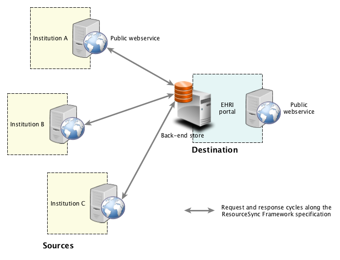

# rspub-gui

Application for ResourceSync publishing

---
- The component in this repository is intended for end users.
- Download latest executables from the [releases page](https://github.com/EHRI/rspub-gui/releases).
- User documentation: [http://rspub-gui.readthedocs.io/en/latest/](http://rspub-gui.readthedocs.io/en/latest/).
- Source location: [https://github.com/EHRI/rspub-gui](https://github.com/EHRI/rspub-gui).
- This GUI based on `rspub-core`. See [https://github.com/EHRI/rspub-core](https://github.com/EHRI/rspub-core).
- In case of questions [contact](https://github.com/EHRI/rspub-gui/issues/new) the EHRI team.

---

## Introduction
The [ResourceSync specification](http://www.openarchives.org/rs/1.0.9/resourcesync) describes 
a synchronization framework for the web consisting of various capabilities that allow third-party systems to remain synchronized with a server's evolving resources.
More precisely the ResourceSync Framework describes the communication between `source` and `destination` aimed at
synchronizing one or more resources. Communication uses `http` and an extension on 
the [Sitemap protocol](http://www.sitemaps.org/protocol.html), an xml-based format for expressing metadata, relevant for synchronization.

### External Logistics (This is not the problem)

_Fig. 1. The ResourceSync Framework Specification at work. Institutions exposing content and ResourceSync metadata
(in the form of sitemaps) on their web servers.
The central hub (in this case the EHRI Portal) is actively collecting resources and keeping them
in sync with the aid of published sitemaps._

The ResourceSync Framework Specification is a well defined protocol between _Source_ and _Destination_.
It describes collecting resources and keeping them synchronized in an efficient way with the aid of sitemaps. In the 
above image the _Sources_ are Collection Holding Institutions and the _Destination_ is the EHRI portal.
The resources that are being synchronized are the Extended Archival Descriptions (EAD) files that describe
collections relevant for the EHRI project. This, the external logistics, is not the problem we are trying
to solve with `rspub-gui` and the `Metadata Publishing Tool`. 

### Internal Logistics

What `rspub-gui` and its application `Metadata Publishing Tool` are trying to
solve is the internal logistics: how can we import, select and filter resources, create resourcesync metadata
and transfer resources (ead-files) and metadata (sitemaps) to the web server of the institution. And let this be done
by content-savvy users that do not necessarily have technical skills.
Comes in `Metadata Publishing Tool`.
Once configured `Metadata Publishing Tool` imports, selects, filters, executes and exports the necessary files, 
all with a push of a button.  

_Fig. 2. A Collection Holding Institution uses Metadata Publishing Tool for a complete publication cycle._
  
In _figure 2._ the complete publication cycle of a Collection Holding Institution is depicted:  
- Import EAD-files from the Archival Information System to a local drive or network drive;
- Make an automated selection of EAD-files based on different criteria;
- Prepare ResourceSync metadata;
- Transfer EAD-files and ResourceSync metadata to the web server of the institution;
- Audit the URL's of the now exposed EAD-files and ResourceSync metadata.

## Where to go from here

