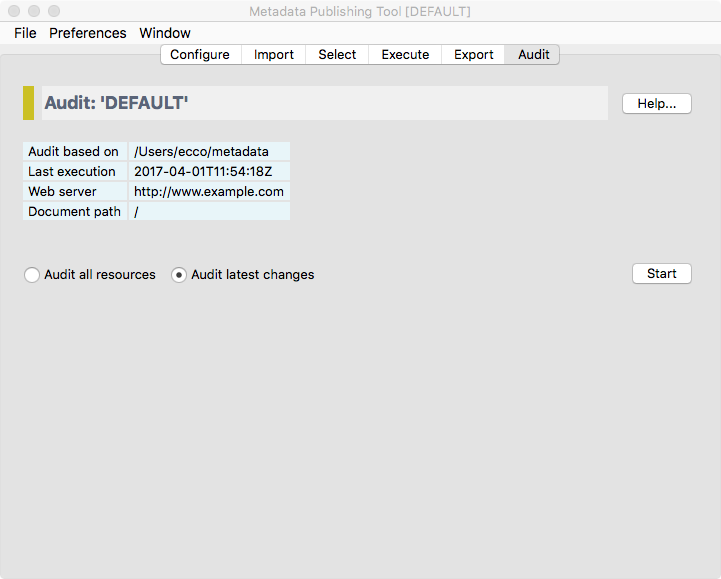
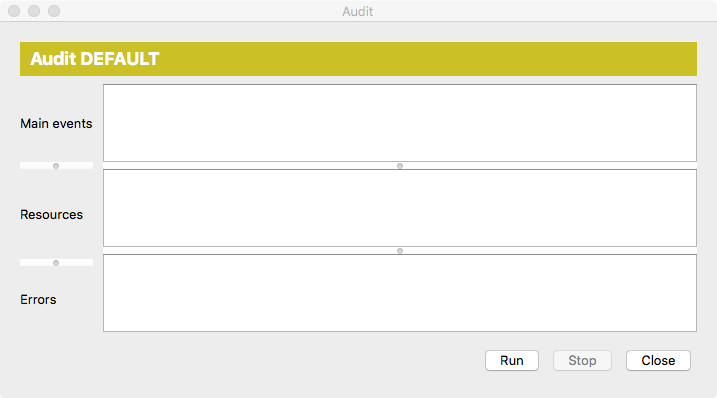
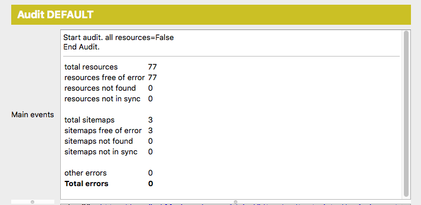

Audit
=====

.. contents:: Check sitemaps, resources and URL's on the web server
    :depth: 1
    :local:
    :backlinks: top

    *Screenshot of the audit page*

.. IMPORTANT::
    The audit page enables verification of the :term:`sitemap` and :term:`resource` URL's on your web server.
    After a successful audit, you can rest assure that your :term:`ResourceSync` site is healthy.

The audit page shows the current :term:`configuration`, the location of the metadata the audit will be based upon,
at what date and time the last execution of the :term:`synchronization` took place,
the web server that is being tested and the `Document path` for documents of the current :term:`configuration`.

The audit process
+++++++++++++++++
You have a choice between auditing all :term:`resource`\ s and auditing the latest changes.

- **Audit all resources** will include all resources mentioned in the :term:`sitemap` documents currently in the :term:`metadata directory`. Useful if you want to completely audit the part of your site that hosts :term:`resource`\ s and :term:`sitemap`\ s of the current :term:`configuration`\ .
- **Audit latest changes** will only include resources that where affected according to the last :term:`synchronization`.

All :term:`sitemap`\ s will be included in the audit, no matter what choice you made for included :term:`resource`\ s.

Press `Start` to open the Audit execution window.

    *The Audit execution window*

The Audit execution window has three areas for reporting events:

Main events
    In this area main events of the audit process will be reported.

Resources
    In this area URL's that are being checked are listed.

Errors
    In this area errors that took place during the audit process are reported.

Press the `Run` button to start the audit process.

While the audit process is running you may at any time press the ``Stop`` button to interrupt the process.

    *Partial screenshot of the Audit execution window after the audit process has finished*

The audit was successful if the **Total errors** in the display reports 0 errors.

If the audit was not successful, try to analyze the reported errors and adjust
:doc:`Configuration <rsgui.configure>` and/or repeat the :doc:`Export <rsgui.export>` process.

