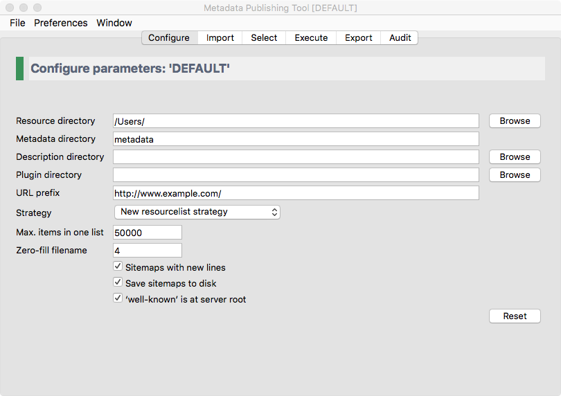
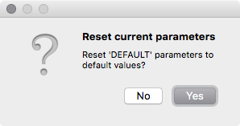

Configuration
=============

.. contents:: Configure :term:`Metadata Publishing Tool`
    :depth: 1
    :local:
    :backlinks: top

    *Screenshot of the configure page*

.. IMPORTANT::
    The parameters on the configuration page constitute all variables needed to :term:`synchronize`
    a :term:`set of resources`\ .
    Variables are validated and, if valid, saved automatically. Multiple sets of parameters can be saved as
    named :term:`configuration`\ s. See :ref:`application-menus-file-label` on how to save, load and delete
    configurations.

    Variables on the configuration page are best set with the help of a technically skilled person. Once variables
    are set and tested to be correct, they can be reused over future synchronization runs.

In the following paragraphs we'll describe each parameter in detail.

.. _config-resource-directory-label:

Resource directory
++++++++++++++++++
The :term:`resource directory` should be an existing directory on the (local or networked) filesystem.
In this base directory resources to be synchronized can be found.
The resource directory should be chosen careful, because it influences the composition of the URL to
the resources that will be exposed in :term:`sitemap`\ s::

    local path to the resource: C:\path\to\resources\ehri\path\to\resource.ead
    resource directory:         C:\path\to\resources\
    URL prefix:                 http://www.example.com/
    composed URL to resource:   http://www.example.com/ehri/path/to/resource.ead

.. IMPORTANT::
    | The URL to a resource is composed as follows:
    | The value of :term:`resource directory` is stripped of the local path to the resource and what remains is prefixed with the :term:`URL prefix`\ .

The URL prefix may have a path segment::

    local path to the resource: C:\path\to\resources\ehri\path\to\resource.ead
    resource directory:         C:\path\to\resources\
    URL prefix:                 http://www.example.com/rs/abc/
    composed URL to resource:   http://www.example.com/rs/abc/ehri/path/to/resource.ead

The resource directory influences the composed URL::

    local path to the resource: C:\path\to\resources\ehri\path\to\resource.ead
    resource directory:         C:\path\to\resources\ehri\path\
    URL prefix:                 http://www.example.com/rs/abc/
    composed URL to resource:   http://www.example.com/rs/abc/to/resource.ead

The button `Browse` will open a file explorer that enables choosing the resource directory.

See also: :ref:`config-url-prefix-label`

.. ATTENTION::
    When using the `EHRI mapping tool <https://github.com/EHRI/ehri-conversion-tools>`_, after conversion
    your :term:`EAD` documents
    are in a directory that bears the conversion date as its name. Point the :term:`resource directory`
    entry to this dated directory before execution of a synchronization.

Metadata directory
++++++++++++++++++
The :term:`metadata directory` is the name of the directory where generated sitemaps are stored.
The value of metadata directory may consist of multiple path elements. The metadata directory is always
relative to the :term:`resource directory`::

    resource directory:         C:\path\to\resources\
    metadata directory:         metadata
    absolute path:              C:\path\to\resources\metadata

If the metadata directory does not exist, it will be created during first execution of a synchronization.

Description directory
+++++++++++++++++++++
The :term:`description directory` should be an existing directory on the (local or networked) filesystem.
In this directory the document that describes the entire site, also known as ``.well-known/resourcesync``
or :term:`source description` is expected
or will be created. If the value of description directory is left blank, the document is expected or will be
created in the :term:`metadata directory`.

The button `Browse` will open a file explorer that enables choosing
the description directory.

Plugin directory
++++++++++++++++
The :term:`plugin directory` is an existing directory on the (local or networked) filesystem.
In this directory or its subdirectories a search for plugins will be conducted. At the moment there are slots
for plugins of type
`ResourceGateBuilder <http://rspub-core.readthedocs.io/en/latest/rst/rspub.pluggable.gate.html#resource-gate-builder>`_.
If plugin directory is left blank, no search will be conducted upon execution of a synchronization.

The button `Browse` will open a file explorer that enables choosing the plugin directory.

.. _config-url-prefix-label:

URL prefix
++++++++++
The :term:`URL prefix` is the basename of the site, optionally followed by a path segment. It is the first part in
the composition of URL's to resources and sitemaps. The relative path to resources and sitemaps calculated from
:term:`resource directory` is the second part::

    local path to the resource: C:\path\to\resources\ehri\path\to\resource.ead
    resource directory:         C:\path\to\resources\
    URL prefix:                 http://www.example.com/
    composed URL to resource:   http://www.example.com/ehri/path/to/resource.ead

The URL prefix may have a path segment::

    local path to the resource: C:\path\to\resources\ehri\path\to\resource.ead
    resource directory:         C:\path\to\resources\
    URL prefix:                 http://www.example.com/rs/abc/
    composed URL to resource:   http://www.example.com/rs/abc/ehri/path/to/resource.ead

See also: :ref:`config-resource-directory-label`

Strategy
++++++++
The :term:`strategy` defines what kind of :term:`sitemap` documents will be generated when a synchronization is executed.
At the moment you can choose between

- **New resourcelist strategy** - At each synchronization run a completely new :term:`resourcelist` will be generated.
  If previous resourcelists or :term:`capabilitylist`\ s exist in the :term:`metadata directory` you will be asked
  if they can be deleted.
- **New changelist strategy** - Will create a new :term:`changelist` at each synchronization run. At the start of
  synchronization, if no resourcelist exists in the :term:`metadata directory`, will conduct
  the `New resourcelist strategy` on first execution.
- **Incremental changelist strategy** - Will increment an existing :term:`changelist` with the newly found changes.
  At the start of synchronization, if no resourcelist exists in the :term:`metadata directory`, will conduct
  the `New resourcelist strategy` on first execution.

.. HINT::
    The strategy can be changed before each successive execution of a synchronization run.

Max. items in one list
++++++++++++++++++++++
The maximum amount of items in one list.
The :term:`sitemap protocol` has an unofficial standard on how many items (links to resources) can be in one list.
This amount can vary between 1 and 50000.

Zero-fill filename
++++++++++++++++++
The amount of digits that generated :term:`sitemap`\ s should have in their filenames. This value should be between
1 and 10. Example of filenames with zero-fill filename set at 4::

    changelist_0000.xml
    changelist_0001.xml
    changelist_0002.xml
    ...
    changelist_9999.xml

With zero-fill filename set to 4, the amount of :term:`changelist`\ s can grow to 10000. This means you can execute
10000 synchronizations in :term:`strategy` mode :term:`new changelist strategy`.

Sitemaps with new lines
+++++++++++++++++++++++
A completely 'pretty print' mechanism for the generated :term:`sitemap`\ s is not (yet) available. Mark the
checkbox for a more human readable version of sitemaps.

.. _config-save-sitemap-to-disk-label:

Save sitemaps to disk
+++++++++++++++++++++
You can do a :term:`trial run` of a :term:`synchronization`\ . A trial run will report an overview of how many
resources are affected,
how many changes have been detected etc. but will not produce new :term:`sitemap`\ s. Leave the checkbox
unchecked for a trial run.

'well-known' at server root
+++++++++++++++++++++++++++
This reflects the locality of the :term:`source description` on the web server.
The prescribed location of this document is in the `.well-known` directory
at the root of the server::

    {server root}/.well-known/resourcesync

However, there may be situations where it is not allowed to access the server root directory. Since EHRI
makes no use of discovering the site by means of the :term:`well-known URI`\ , this document is not strictly
necessary. The value for `'well-known' at server root` is used for computing the URL's that link
:term:`capabilitylist`\ s to their parent document.

Mark the checkbox if the source description is at the server root. If left unchecked the program assumes that
the source description is in the :term:`metadata directory`\ .

Reset
+++++
The Reset button will reset the current :term:`configuration` to the default settings, after you confirm
the warning dialog.

    *Warning dialog after pressing the Reset button*

.. CAUTION::
    Resetting the current configuration also affects the currently set values on wizard pages
    :doc:`Import <rsgui.import>`\ , :doc:`Select <rsgui.select>` and :doc:`Export <rsgui.export>`\ .

