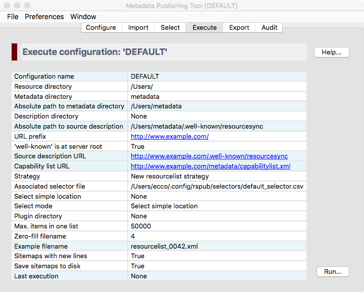
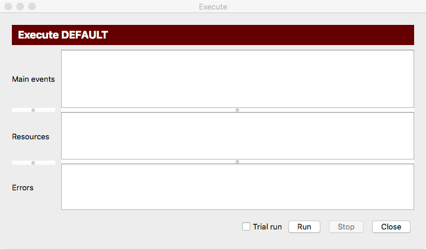

Execute a synchronisation
=========================

.. contents:: Synchronize resources with :term:`Metadata Publishing Tool`
    :depth: 1
    :local:
    :backlinks: top

    Screenshot of the ``execute`` page

.. IMPORTANT::
    On the execute page you can inspect your parameters and start a synchronisation.

Inspect parameters
++++++++++++++++++
The execute page gives an overview of the value of all parameters that are involved with a synchronisation.
The parameters in boxes with a white background can directly be set on pages :doc:`Configure <rsgui.configure>` and
:doc:`Select <rsgui.select>`; the values in boxes with a blueish-grey background are derived or computed values.

Synchronize resources
+++++++++++++++++++++
Press the `Run...` button on the execute page to start a synchronisation run.

    Screenshot of the synchronization window

The synchronization window has three areas for reporting events:

Main events
    In this area main events of the synchronization process will be reported.

Resources
    In this area resources that are synchronized are listed.

Errors
    In this area errors that took place during the synchronization process are reported.

All areas can be enlarged or made smaller by grabbing the horizontal handle bars. Of course, the synchronization
window itself can also be reshaped.

