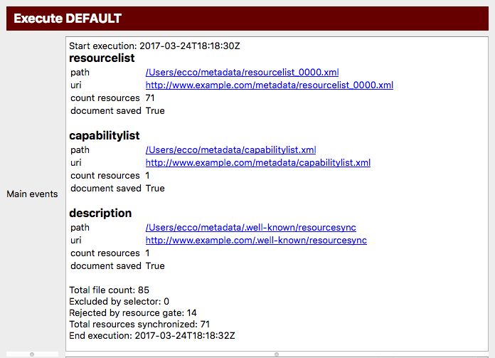

Execute a synchronization
=========================

.. contents:: Synchronize resources with :term:`Metadata Publishing Tool`
    :depth: 1
    :local:
    :backlinks: top

.. figure:: ../img/execute/execute.png

    *Screenshot of the execute page*

.. IMPORTANT::
    On the execute page you can inspect the parameters of the current :term:`configuration`
    and start a :term:`synchronization`\ .

Inspect parameters
++++++++++++++++++
The execute page gives an overview of the value of all parameters that are involved with a :term:`synchronization`\ .
The parameters in boxes with a white background can directly be set on pages :doc:`Configure <rsgui.configure>` and
:doc:`Select <rsgui.select>`; the values in boxes with a blueish-grey background are derived or computed values.

.. _execute-synchronise-resources-label:

Synchronize resources
+++++++++++++++++++++
Press the `Run...` button on the execute page to start a :term:`synchronization` run.

.. figure:: ../img/execute/execute_02.png

    *Screenshot of the synchronization window*

The synchronization window has three areas for reporting events:

Main events
    In this area main events of the synchronization process will be reported.

Resources
    In this area resources that are synchronized are listed.

Errors
    In this area errors that took place during the synchronization process are reported.

All areas can be enlarged or made smaller by grabbing the horizontal handle bars. Of course, the synchronization
window itself can also be reshaped.

Press the `Run` button to start the synchronization process. If the chosen :term:`strategy` is
:term:`new resourcelist strategy`\ , a confirmation window will appear asking if it is OK to delete existing
:term:`sitemap`\ s in de :term:`metadata directory`\ .

.. TIP::
    A :term:`trial run` will report the number of resources that are affected and all :term:`sitemap`\ s
    that will be created, without writing them to disk.

While the synchronization process is running you may at any time press the ``Stop`` button to interrupt the process.

.. figure:: ../img/execute/execute_03.png

    *Screenshot of the synchronization window while the synchronization process is running*

When the synchronization process has finished the main events of the synchronization process are reported.

    *Part of the synchronization window after the synchronization process has finished*

Clicking on he paths to the :term:`sitemap`\ s will open your local editor for xml-files with the contents
of the sitemap. As long as the sitemaps are not exported to your web site the links to the URI's are of course stale
or will not function.

