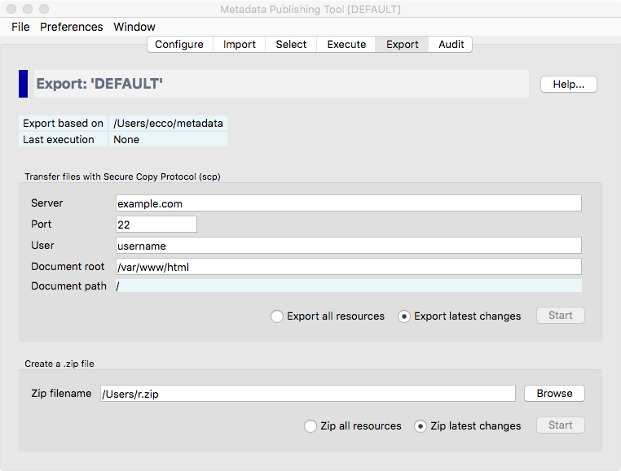

Export resources and sitemaps
=============================

.. contents:: Transfer resources and sitemaps to a web server
    :depth: 1
    :local:
    :backlinks: top

    *Screenshot of the export page*

.. IMPORTANT::
    The local :term:`synchronization` will not publish your :term:`resource`\ s and :term:`sitemap`\ s. For that,
    :term:`resource`\ s and :term:`sitemap`\ s must be made available on a web server.
    The export page offers two methods to export :term:`resource`\ s and :term:`sitemap`\ s from your local or networked
    drive to your web server:

    - **Transfer files with SCP** - Uses the Secure Copy Protocol (:term:`scp`) to transfer files directly to your webserver.
    - **Create a zip file** - This method creates a zip file of your :term:`resource`\ s and :term:`sitemap`\ s. You can hand over this zip file to your system administrator who should take care of publishing the contents on the web server.

    There are other ways to publish in conformance with :term:`ResourceSync`. See for this [link to appendix].

The export page shows the current :term:`configuration`, the location of the metadata the export will be based upon
and at what date and time the last execution of the :term:`synchronization` took place.

    *Detail of the export page*

.. ATTENTION::
    Do not change parameters on the :doc:`Configuration page <rsgui.configure>` in between a :term:`synchronization`
    run and the export. The outcome of the export may be undecided if you do so. Always export
    :term:`resource`\ s and :term:`sitemap`\ s right after a fresh :term:`synchronization` run.

Transfer files with SCP
+++++++++++++++++++++++

    *Detail of the export page with the SCP parameters*

The parameters for export with :term:`scp` can best be set with the help of a technically skilled person.
These parameters are automatically saved with the current :term:`configuration`.

Server
    The name or IP address of the web server.

Port
    The :term:`scp` port on the web server. Default :term:`scp` port is 22.

User
    The username on the web server.

Document root
    The document root is the folder where the website files for a domain name are stored. With the Apache
    HTTP Server for instance this defaults to ``/var/www/html``.

The `Document path`, relative to the `Document root`, is derived from the :term:`URL prefix` you set on the
:doc:`Configuration page <rsgui.configure>`. (The `Document path` will be equal to the path segment of the
:term:`URL prefix`\ .)

You have a choice between exporting all :term:`resource`\ s and export the latest changes.

- **Export all resources** will include all resources mentioned in the :term:`sitemap` documents currently in the :term:`metadata directory`. Useful if you want to completely update the part of your site that hosts :term:`resource`\ s and :term:`sitemap`\ s of the current :term:`configuration`\ .
- **Export latest changes** will only include resources that where affected according to the last :term:`synchronization`. The default. This will suffice in most occasions.

Press `Start` to open the :term:`scp` Transport execution window.

    *The scp Transport execution window*

The scp Transport execution window has three areas for reporting events:

Main events
    In this area main events of the export process will be reported.

Resources
    In this area files that are exported are listed.

Errors
    In this area errors that took place during the export process are reported.

Press the `Run` button to start the export process. A popup dialog will ask for your password for the user at the
web site server.

.. TIP::
    | A password may not be needed with key-based authentication.
    | See for instance: `Configure SSH Key-Based Authentication <https://www.digitalocean.com/community/tutorials/how-to-configure-ssh-key-based-authentication-on-a-linux-server>`_

While the import process is running you may at any time press the ``Stop`` button to interrupt the process.

    *Screenshot of the scp Transport execution window while the import process is running*

After the export has finished without errors your :term:`resource`\ s and :term:`sitemap`\ s at the web server
are now up to date with the local changes after your latest :term:`synchronization`\ .

    *Partial screenshot of the scp Transport execution window after the export process has finished*

.. TIP::
    The

Create a zip file
+++++++++++++++++
