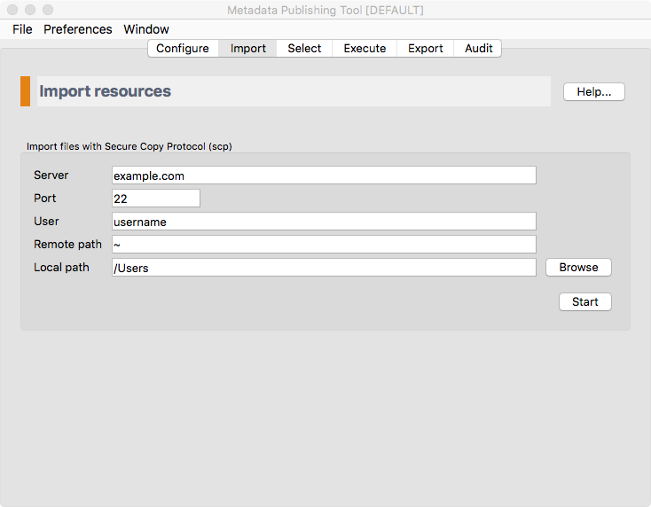
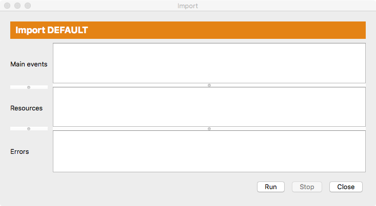
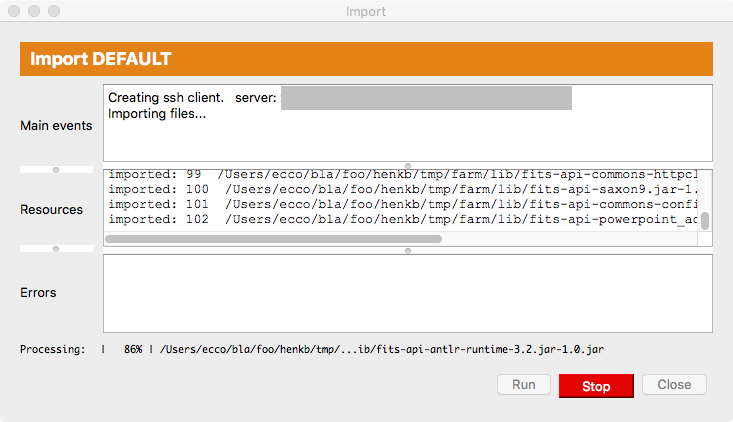

Import resources
================

.. contents:: Import files from a server with the :term:`Metadata Publishing Tool`
    :depth: 1
    :local:
    :backlinks: top

    *Screenshot of the import page*

.. IMPORTANT::
    The import functionality is only necessary if your files (:term:`EAD` files in the case of :term:`EHRI`)
    are on a server. If your files are on a local or networked drive you may skip this page of the wizard.

    With the import page you can copy files from the remote server to a local or networked drive with
    the aid of the Secure Copy Protocol (:term:`scp`).

    Parameters on the import page are best set with the help of a technically skilled person.
    The variables on this page are part of the same named :term:`configuration` as the one from the
    :doc:`rsgui.configure` page and are saved automatically.
    Once parameters on this page are set, all you have to do each time you want to import your
    remote files to your local environment is press the `Start` button (and remember your password).

In the following paragraphs we'll describe the import process in detail.

SCP parameters
++++++++++++++
.. HINT::
    Different scp parameters can be set on each :term:`configuration`. They are saved automatically.

Server
    The name or IP address of the server.

Port
    The port on the remote server. Default :term:`scp` port is 22.

User
    The username on the remote server.

Remote path
    The path to the directory on the remote host. All files and folders in the remote directory will be
    copied recursively to the **Local path** (see below).

Local path
    The path to the directory on the local or networked drive that you wish to copy to.
    All files and folders in the directory on the **Remote path** (see above) will be
    copied recursively to this directory. Directories on the local path that do not exist will be created.

    The button `Browse` will open a file explorer that enables choosing the local directory.

Running an import
+++++++++++++++++
After pressing the `Start` button, the import execution window will open.

    *Screenshot of the import execution window*

The import execution window has three areas for reporting events:

Main events
    In this area main events of the import process will be reported.

Resources
    In this area files that are imported are listed.

Errors
    In this area errors that took place during the import process are reported.

All areas can be enlarged or made smaller by grabbing the horizontal handle bars. Of course, the import execution
window itself can also be reshaped.

Press the `Run` button to start the import process. A dialog appears in which you have to type your password for
the remote server.

.. TIP::
    | A password may not be needed with key-based authentication.
    | See for instance: `Configure SSH Key-Based Authentication <https://www.digitalocean.com/community/tutorials/how-to-configure-ssh-key-based-authentication-on-a-linux-server>`_

While the import process is running you may at any time press the ``Stop`` button to interrupt the process.

    *Screenshot of the import execution window while the import process is running*

After the process has ended without errors the complete file and folder tree of the remote path is
now on the local path.