Mac OS installer
================

.. contents:: Install :term:`Metadata Publishing Tool` on Mac OS using a wizard
    :depth: 2
    :local:
    :backlinks: top

.. ATTENTION::
    If a previous release of `Metadata Publishing Tool` was installed on your machine,
    first uninstall this older release. See :ref:`uninstall-mpt-mac-label`.

Download the latest ``MPT_mac_installer.dmg`` from
the `release page <https://github.com/EHRI/rspub-gui/releases>`_ of the rspub-gui project on gitHub.
After download, double-click the downloaded ``MPT_mac_installer.dmg``. This will mount the ``MPT_mac_installer`` image
on your system.

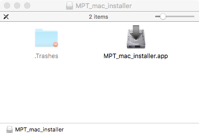

    Mounted MPT_mac_installer

Double-click the ``MPT_mac_installer.app`` in the mount window.

.. _circumvent-security-mac-label:

Circumvent security
-------------------
Because the software has not been code-signed by a trusted authority, security settings on your machine may object
to executing it right away.

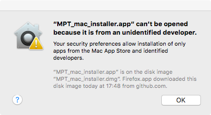

    Security warning on Mac OS

| Click `OK`.
| Open > `System Preferences` > `Security & Privacy`. You may see the following message.
|

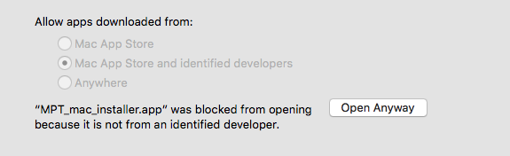

    Part of System Preferences, Security & Privacy

| Click `Open Anyway`.
|

Alternatively you may have to lower your security settings temporary. Under `Allow apps downloaded from:` click
`Anywhere`. After the installation process has completed you may restore your security settings.

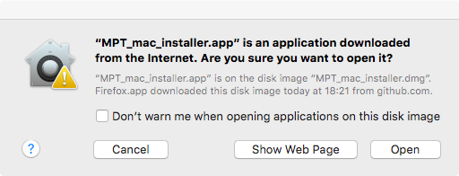

    Last warning from security

After starting the ``MPT_mac_installer.app`` you may receive a last warning. Click `Open` to start the install
wizard.

.. _run-wizard-mac-label:

Run the install wizard
----------------------
The install wizard has several screens and will guide you through the installation process.
On average, you can accept the predefined values.

**Welcome message**

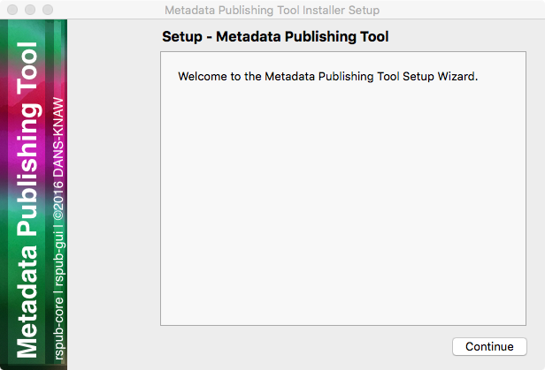

    Welcome message of the install wizard

The wizard opens with a welcome message. Click `Continue`.

**Installation folder**

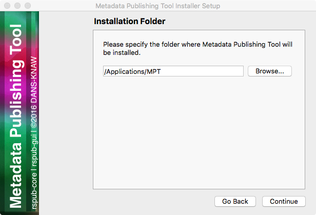

    Choosing the installation folder

Choosing the installation folder. The default value is ``/Applications/MPT``.
Choose `Browse...` if you want a different installation folder, choose `Continue` when done.

**Select components**

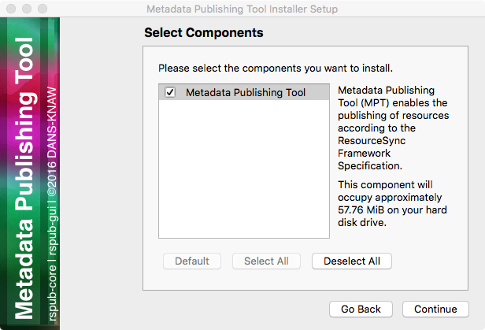

    Selecting components

`Metadata Publishing Tool` has only one component. So leave the component selected and click `Continue`.

**License agreement**

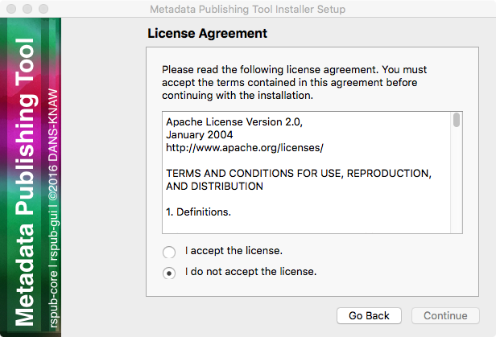

    Inspecting the license

Code and executables of the `Metadata Publishing Tool` are distributed under the
`Apache License 2.0 <http://apache.org/licenses/LICENSE-2.0>`_. You must accept the license agreement before
you may proceed with the install wizard. Click `Continue` when done.

**Ready to install**

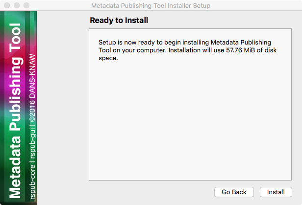

    Ready to install

Click `Install`.

**Installing Metadata Publishing Tool**

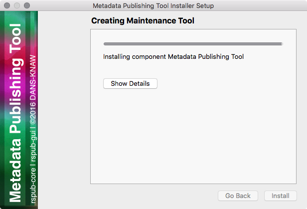

    Progress of installation

The installation process will now begin. An indication of progress will be shown.

**Completing the Metadata Publishing Tool Wizard**

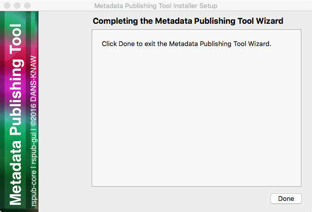

    Completing the installation

After installation has completed, the last screen of the installation wizard is shown. Click `Done` to exit
the wizard. You may now eject the mounted ``MPT_mac_installer`` image.

.. _start-mpt-mac-label:

Start Metadata Publishing Tool
------------------------------

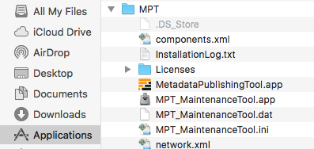

    `MetadataPublishingTool.app` and `MPT_MaintenanceTool.app` in the folder ``MPT`` in the Applications folder

After completing the installation wizard you can find ``MetadataPublishingTool.app`` and the
``MPT_MaintenanceTool.app`` in the folder ``MPT`` of your ``/Applications`` folder. Alternatively you
can click on the respective icon in your Launchpad.

.. _uninstall-mpt-mac-label:

Uninstall Metadata Publishing Tool
----------------------------------
The `Metadata Publishing Tool` and its components can be removed from your machine by the
`MPT Maintenance Tool`. Click the shortcut `MPT_MaintenanceTool` in your Launchpad or
navigate to ``/Applications/MPT`` and double-click ``MPT_MaintenanceTool.app``.
The uninstall wizard will begin.

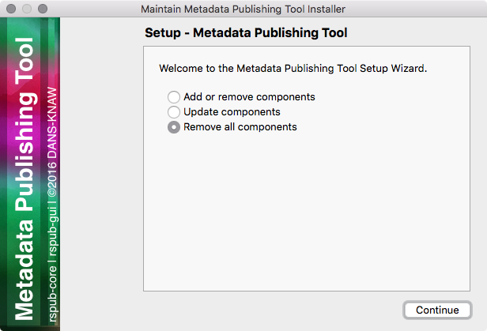

    Removing Metadata Publishing Tool

Click `Continue`.

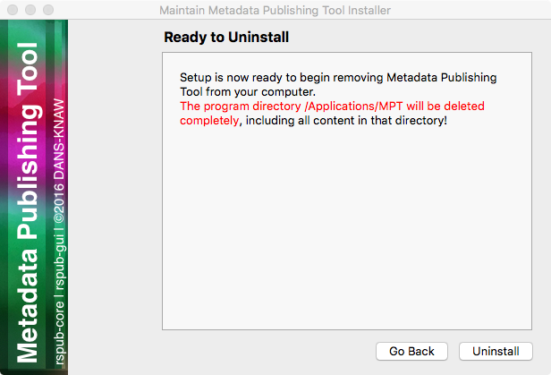

    Ready to uninstall

Click `Uninstall`. After the uninstall process has run click `Finish`. The folder ``MPT`` and its
contents are now removed from your system.
