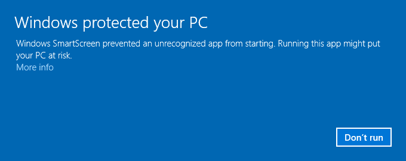
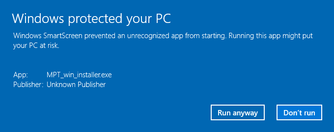
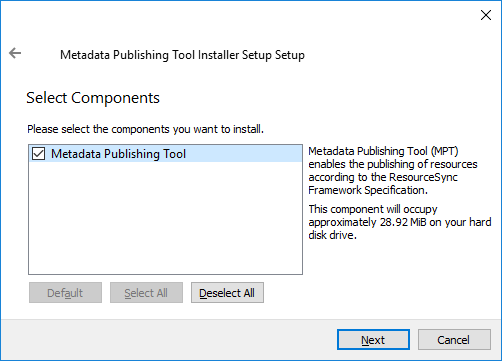
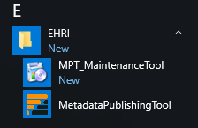
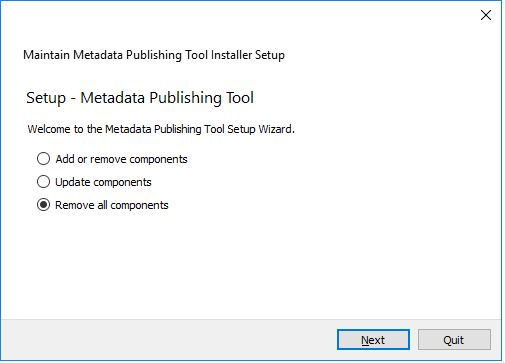

Windows installer
=================

:samp:`Install the {Metadata Publishing Tool} on Windows`

| :ref:`circumvent-security-label`
| :ref:`run-wizard-label`
| :ref:`start-mpt-label`
| :ref:`uninstall-mpt-label`
|

Download the latest ``MPT_win_installer.exe`` from
the `release page <https://github.com/EHRI/rspub-gui/releases>`_ of the rspub-gui project.

.. _circumvent-security-label:

Circumvent security
-------------------
After download, double-click the downloaded ``MPT_win_installer.exe``.
Because the software has not been code-signed by a trusted authority, security settings on your machine may object
to executing it right away.

Windows 7
^^^^^^^^^
On Windows 7 you may see a sign similar to this.

    Security warning on Windows 7

Click `Run` and proceed to :ref:`run-wizard-label`.

Windows 10
^^^^^^^^^^
On Windows 10 a blue warning may appear.

    Security warning on Windows 10

Click `More information` on the left side of this blue screen...

    Security warning on Windows 10, second screen

Click `Run anyway` and proceed to :ref:`run-wizard-label`.

.. _run-wizard-label:

Run the install wizard
----------------------
The install wizard has several screens and will guide you through the installation process.
On average, you can accept the predefined values.

Welcome message
^^^^^^^^^^^^^^^

    Welcome message of the install wizzard

The wizard opens with a welcome message. Click `Next`.

Installation folder
^^^^^^^^^^^^^^^^^^^

    Choosing the installation folder

Choosing the installation folder. The default value is ``C:\Program Files (x86)\EHRI\MetadataPublishingTool``.
Choose `Browse...` if you want a different installation folder, choose `Next` when done.

Select components
^^^^^^^^^^^^^^^^^

    Selecting components

`Metadata Publishing Tool` has only one component. So leave the component selected and click `Next`.

License agreement
^^^^^^^^^^^^^^^^^

    Inspecting the license

Code and executables of the `Metadata Publishing Tool` are distributed under the
`Apache License 2.0 <http://apache.org/licenses/LICENSE-2.0>`_. You must accept the license agreement before
you may proceed with the install wizard. Click `Next` when done.

Start Menu shortcuts
^^^^^^^^^^^^^^^^^^^^

    Setting shortcuts

Default a shortcut to the ``MetadataPublishingTool.exe`` will be placed in the program group `EHRI`.
Click `Next` when done.

Ready to install
^^^^^^^^^^^^^^^^

    Ready to install

Click `Next` to continue. A security warning may again appear, telling you are about to install software from
an unknown publisher. Click `Yes` to proceed.

Installing Metadata Publishing Tool
^^^^^^^^^^^^^^^^^^^^^^^^^^^^^^^^^^^

    Progress of installation

The installation process will now begin. An indication of progress will be shown.

Completing the Metadata Publishing Tool Wizard
^^^^^^^^^^^^^^^^^^^^^^^^^^^^^^^^^^^^^^^^^^^^^^

    Completing the installation

After installation has completed, the last screen of the installation wizard is shown. Click `Finish` to exit
the wizard.

.. _start-mpt-label:

Start Metadata Publishing Tool
------------------------------

    Shortcuts to Metadata Publishing Tool and the MPT Maintenance Tool in the EHRI group

After completing the installation wizard you can find shortcuts to ``MetadataPublishingTool.exe`` and the
``MPT_MaintenanceTool.exe`` in the group `EHRI` of your Start Menu.

.. _uninstall-mpt-label:

Uninstall Metadata Publishing Tool
----------------------------------
The `Metadata Publishing Tool` and its components can be removed from your machine by the
`MPT Maintenance Tool`. Click the shortcut `MPT_MaintenanceTool` in the `EHRI` group of your Start Menu or
navigate to ``C:\Program Files (x86)\EHRI\MetadataPublishingTool`` and double click ``MPT_MaintenanceTool.exe``.
The uninstall wizard will begin.

    Removing Metadata Publishing Tool

Click `Next` to continue.

    Ready to uninstall

Click `Uninstall`. After the uninstall process has run click `Finish`. The folder ``MetadataPublishingTool`` and its
contents are now removed from your system. The folder ``EHRI`` may still remain with other executables or is empty
if you did not install other programs in there.

