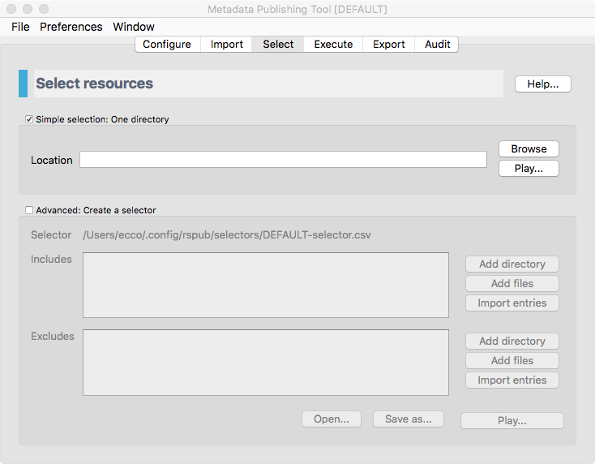
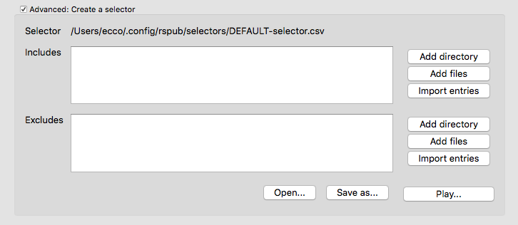

Select resources
================

.. contents:: Select files to be synchronized with :term:`Metadata Publishing Tool`
    :depth: 1
    :local:
    :backlinks: top

    *Screenshot of the select page*

.. IMPORTANT::
    On the select page you decide which files will be synchronized. The page offers a choice on how to select:

    - **Simple select** - All files in one directory will be synchronized, including files in subdirectories.

    - **Advanced select** - Multiple files and folders can be included and multiple files and folders can be excluded. This gives the opportunity to precisely select the resources that will be synchronized.

    The variables on this page are part of the same named :term:`configuration` as the one from the
    :doc:`rsgui.configure` page and are saved automatically.
    Different selections can be set and saved for each :term:`configuration`.

Simple selection
++++++++++++++++
Select the checkbox for `Simple selection: one directory`.
Press the `Browse` button to select the directory that contains the resources that should be synchronized.

.. HINT::
    The selected directory should be equal to or a subdirectory of the :term:`resource directory` that you
    chose on the :doc:`Configure <rsgui.configure>` page. Only resources that are in the :term:`resource directory`
    or one of its subdirectories are subject to synchronization.

Press the `Play...` button if you want to get an impression of how many and which files are in the chosen
directory and its subdirectories. The list and count displayed are estimates; automatically excluded files like
hidden files are not excluded in this display, but will be excluded in the synchronization.

Advanced selection
++++++++++++++++++
Select the checkbox for `Advanced: create a selector`.

    *The advanced part of the select page*

.. IMPORTANT::
    With advanced selection you can choose multiple files and folders for inclusion and exclusion of synchronization.
    For instance if you include the directory ``C:\my_files\ehri`` but want to exclude its subdirectory
    ``C:\my_files\ehri\other_files``.

    Another feature is the ability to import lists of path names. This opens the possibility of doing the
    selection of what will be synchronized in or by another application.

Press `Add directory` or `Add files` respectively if you want to browse to directories or files to be included or
excluded. When adding files you can choose multiple files by pressing `Shift` and `Ctrl` or `Cmd` keys while
choosing files with your mouse. You can also type or paste path names in the respective boxes. Remove path names
by simply selecting and deleting them.

To import lists of path names press the `Import entries` button. Choose the file that contains the
path names in the explorer that opens. Each entry in the file with path name entries should start on a new line.

.. HINT::
    Selected directories or files should be in the :term:`resource directory` that you
    chose on the :doc:`Configure <rsgui.configure>` page. Only resources that are in the :term:`resource directory`
    or in one of its subdirectories are subject to synchronization.

Press the `Play...` button if you want to get an impression of how many and which files are included and how many
and which files are excluded.
The lists and counts displayed are estimates; automatically excluded files like
hidden files are not excluded in this display, but will be excluded in the synchronization.

The entries in `Includes` and `Excludes` are automatically saved with each :term:`configuration`. Besides that,
they can also be saved and loaded from the filesystem by pressing the `Save` and `Open` buttons respectively.